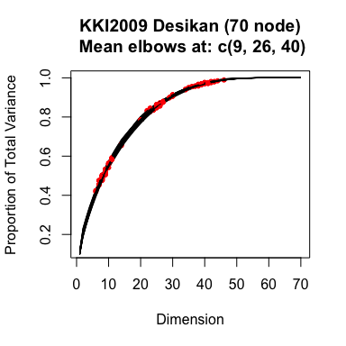

# scree plots
Greg Kiar  
April 15, 2016  

Performing classification/regression analysis on brain graphs requires us to use some feature of our data as input, X, and some covariate as our output class, Y. The simplest feature one can use is a single dimension statistic which attempts to summarize the graph, such as edge count, max degree, or edge probability. The largest feature would be the graph itself, performing no transformations on it (except perhaps vectorizing the adjacency matrix, if the algorithm requires it).

Somewhere between these two extremes lies an operating point that will be both effective at preserving the information we want to observe, and is computationally less cumbersome than using entire graphs, which can be extremely challenges as graphs grow in size.

A common dimensionality reduction technique that is used on graphs is called Principal Component Analysis (PCA). PCA uses the singular values returned by the SVD. Plotting these values allows us to see how much of the total variance in the data is represented in each dimension.

Here, we perform PCA on populations of graphs and atlases, in order to help us decide how many dimensions the features we use will be.

The first step is loading in a sample of graphs, and extracting their adjacency matrices:


```r
name = 'KKI2009 Desikan (70 node)'
nodes = 70
path <- '/Users/gkiar/code/classes/upward-spiral/grelliam/data/KKI2009/'

format <- paste('\\.', 'graphml', '$', sep='')
graph_files <- list.files(path=path, pattern=format, recursive=TRUE, full.names=TRUE)

gs <- load_graphs(graph_files, nodes)
```

```
## [1] "Total number of graphs found: 42"
## [1] "Number of graphs which failed to load:  42"
## [1] "Graphs with improper dimensions:  0"
## [1] "Graphs with less than 1e+05 edges: 0"
## [1] "Remaining graphs available for processing: 42"
```

```r
A <- gs[[1]]
len <- gs[[3]]
```


Now, for each graph we perform an SVD. We also compute the elbows of the Scree Plot so that we can more easily identify which dimensions we should consider embedding into.

```r
SVD <- foreach(i = 1:len) %do% { svd(A[,,i]) }
diags <- foreach(i = 1:len) %do% { SVD[[i]]$d }
elbs <- foreach(i = 1:len, .combine="rbind") %do% { getElbows(SVD[[i]]$d, n=3, plot = FALSE)}
melbs <- ceiling(apply(elbs, 2, mean))
mdiag <- foreach(i = 1:length(melbs)) %do% { mean(sapply(diags, function(x) { x[melbs[i]] }))}
```

Lastly, we plot our data in a form where our ordinate represents the amount of total variance in the data represented by a feature that is D dimensional, shown by our abscissa.

<!-- -->
