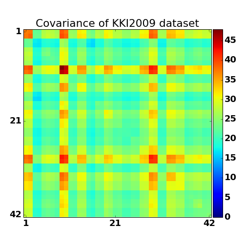
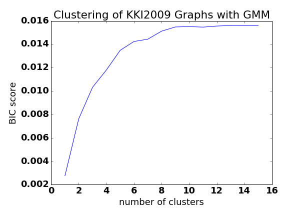

## Progress Report - March 20th, 2016
**Table of Contents:**
- [Overview](./distribution_properties.md#overview)
- [KKI2009, MRN114, and SWU4 Datasets](./distribution_properties.md#kki2009-mrn114-and-swu4-datasets)
  - [Decriptive Analysis](./distribution_properties.md#descriptive-analysis)
  - [Exploratory Analysis](./distribution_properties.md#exploratory-analysis)
  - [Inferential Analysis](./distribution_properties.md#inferential-analysis)
  - [Predictive Analysis](./distribution_properties.md#predictive-analysis)
  - [Testing Assumptions](./distribution_properties.md#testing-assumptions)
  - [Next Steps](./distribution_properties.md#next-steps)
- [Methods](./distribution_properties.md#methods)
  - [Decriptive Analysis](./distribution_properties.md#descriptive-analysis-1)
  - [Exploratory Analysis](./distribution_properties.md#exploratory-analysis-1)
  - [Inferential Analysis](./distribution_properties.md#inferential-analysis-1)
  - [Predictive Analysis](./distribution_properties.md#predictive-analysis-1)
  - [Testing Assumptions](./distribution_properties.md#testing-assumptions-1)

Number of Non-Zero (NNZ) edge weights
Vertex Degree
Edge Count
Clustering Coefficient
Scan Statistic-i
Eigen Value
Betweenness Centrality
Simulated Data
Number of Non-Zero (NNZ) edge weights
Vertex Degree
Edge Count
Clustering Coefficient
Scan Statistic-i
Eigen Value
Betweenness Centrality
Comparison

----------

### Overview
Before performing inference on our data it is necessary to better understand properties of the graphs, possible distributions from which they are sampled, and possible key differences between classes over which we are trying to classify. Here, we have perfomed a follow-up to the [exploratory](./progress_report.md#exploratory-analysis) and [decriptive](./progress_report.md#descriptive-analysis) analyses performed previously, wherein we explore properties of the distributions as well as point estimates, such as edge count, which were estimated previously.

### KKI2009, MRN114, and SWU4 Datasets
words

#### Number of Non-Zero (NNZ) edge weights
words

#### Vertex Degree
words

#### Edge Count
words. left in fig so I had template code

#### Clustering Coefficient
words

#### Scan Statistic-i
words

#### Eigen Value
words

#### Betweenness Centrality
words

### Simulated Data
words

#### Number of Non-Zero (NNZ) edge weights
words

#### Vertex Degree
words

#### Edge Count
words. left in fig so I had template code

#### Clustering Coefficient
words

#### Scan Statistic-i
words

#### Eigen Value
words

#### Betweenness Centrality
words

### Comparison
words
