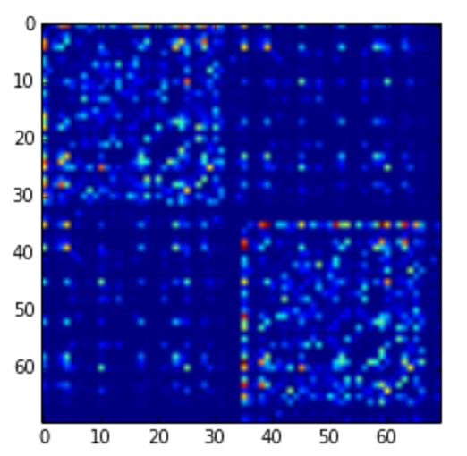

## Progress Report - March 20th, 2016

### Overview
Mental illness plagues humanity. Causing huge financial social burden, mental illness is the leading cause of disability globally. As such, we have been analyzing the structure of brain graphs with the goal of understanding underlying patterns or features which allow us to classify subjects based on observed covariates.

### Scientific Questioning
Here we will discuss our analysis of this data, starting with exploratory and descriptive analysis, up to preliminary work on hypothesis testing and classification. The questions posed and their outcomes are described sequentially, with code and methods used to answer them described at the end of this report.

#### Descriptive Analysis
The natural first step when working with any data is to ask exploratory and descriptive questions about it. We have been working with the KKI2009, SWU4, and MRN114 datasets, so we began by seeking some basic understanding of this data. It was important to understand the structure of our data, so we began by asking questions such as dataset size, number of nodes, and number of invalid (i.e. Inf/Na/NaN) data points were present in our data. Tabulated below are the results of these questions, where N  is the number of subjects, and |V| is the number of vertices. The final descriptive question asked was regarding the sparsity of our graphs: how many edges with weight greater than 0 exist out of the total possible number of edges. We found that across the entire dataset the edge density was 0.561.

| Query | MRN114 | KKI2009 | SWU4 |
|-------|--------|-------|------|
|N      | 114    | 42    | 454  |
| \|V\| | 70     | 70    | 70   |
|Invalid values | 0 | 0 | 0 |

#### Exploratory Analysis
Knowing now that our graphs are all equal in size (i.e. number of nodes), contain no obviously invalid data, but vary greatly in number of subjects, we seek to understand some more features specific to each dataset. The first exploratory question we asked was seeking to determine the average edge degree for each dataset. These results are tabulated below. We also compute the mean brain graph and visualize it, below.

| Query | MRN114 | KKI2009 | SWU4 |
|-------|--------|---------|------|
|Average Degree | 2862.2| 1396.7 | 2848.1 |

We notice here there is a large difference in the mean degree in these graphs, so in order to understand this further we plotted a histogram of the edge weights for each dataset. This can be seen below.

We notice from these graphs that most of the edges are very low weights, and likely due to some type of noise. Taking the log of our graphs may make these graphs more robust to outliers in our further analysis.

#### Inferential Analysis
We now seek to understand class conditional differences within our datasets. From here, we will be only looking at the KKI2009 dataset. The covariate we are seeking to separate graphs based upon is sex. Firstly we must pick a feature of our graphs to test this difference under. As we'd looked at this feature in our exploratory analysis, we chose to use edge density as our feature. Running a wilcoxon test on this population, in which 22 subjects were male and 20 subjects were female, we found the following mean probabilities of edge based on class.

| Class | Mean edge probability |
|-------|-----------------------|
| Female| 0.014041836735        |
| Male  | 0.013130376117        |

We found that the difference between these populations was statistically significant with an alpha value of 0.05, produciing a p value of 0.022768743719. Since we found a statistically significant difference between classes, we can naturally proceed to trying to classify subjects based on their edge density.

#### Predictive Analysis
Now that a class conditional edge probability difference has been observed, we can attempt to explot this to classify subjects. Several types of classifiers were trained and tested using LOO cross-validation, and their results are tabulated below. Note that chance classification in this dataset is 47% accuracy, since the dataset has more males than females.

| Classifier | Accuracy | Standard Deviation |
|------------|----------|--------------------|
|Nearest Neighbors | 0.48 | +/- 1.00 |
|Linear SVM | 0.55 | +/- 1.00 |
|Random Forest| 0.57 | +/- 0.99 |
|Linear Discriminant Analysis| 0.45 | +/- 1.00 |
|Quadratic Discriminant Analysis| 0.71 | +/- 0.90|

Here we notice that with the only classifier which performs significantly better than chance is the Quadratic Discriminant Analysis. In order to gain some understanding as to why this is the case, we proceed to reevaluate our procedure thus far and test the assumptions we've been making up until this point.

#### Testing Assumptions
Up to this point, our analysis had made two large assumptions about our data: the graphs are sampled idependently and identically, and edges within the graph were sampled independently and identically. Another assumption made implicitly when doing classification with QDA that differs from the other techniques is that our covariance matrix differs across classes. Here, we test each of these assumptions to see if we can impove our model.

First, we test whether the graphs are sampled independently from each other and identically. Plotted below is the covariance matrix of our graphs. Significant content in the off-diagonal suggests that these graphs are in fact dependent. Below that, is a figure which plots the BIC score when doing GMM clustering on the graphs. We see that the optimal number of clusters is greater than 1, suggesting they are not identically distributed, either.

Next, we investigate the same properties about our edges. Shown below are the same two figures for edges rather than graphs. We again notice lots of content in the off-diagonal of our covariance matrix, suggesting dependence between edges. Notice in the identical test, however, that a clear "optimal" number of clusters does exist whereas previously the plot seemed monotonically increasing. Here we notice an optimal clustering of 4, which can later be leveraged when doing clustering or classification.

Finally, we test whether or not the assumption made implicitly in QDA, that our classes have different covariance matrices, is true. Shown below is a plot of each of the class covariance matrices, as well as a plot of the absolute difference of this matrix. We can see a significant difference in this matrix, which suggests why QDA outperformed the other methods (certainly LDA, which explicitly assumes classes have an identical covariance matrix).

#### Next Steps
Thus far we have learned a fair amount about the edge densities and properties of our data. Moving forward, we can cluster our data into the four edge categories shown while testing the identical edge assumption, and then compute edge densities among each of them for a higher dimensional feature overwhich we are testing hypotheses and classifying covariates. We can also expand to regressing subject age, with several methods. Finally, once we are confident in and satisfied with a method testing on this dataset, we can expand towards testing the method on the MRN114 and SWU4 datasets, as well.

### Methods
Tabulated below is the source code for all of the question sets explored below.

| Question Type | Code |
|---------------|------|
| Descriptive | [**``./code/descriptive_and_exploratory_answers.ipynb``**](./code/descriptive_and_exploratory_answers.ipynb) |
| Exploratory | [**``./code/descriptive_and_exploratory_answers.ipynb``**](./code/descriptive_and_exploratory_answers.ipynb) |
| Inferential | [**``./code/inferential_simulation.ipynb``**](./code/inferential_simulation.ipynb) |
| Predictive  | [**``./code/classification_simulation.ipynb``**](./code/classification_simulation.ipynb) |
| Testing Assumptions | [**``./code/test_assumptions.ipynb``**](./code/test_assumptions.ipynb) |

**Prompt**: a report stating and organizing everything you've done so far to learn about and explore your data. this includes all the types of questions, ordered accordingly, plus a separate methods section.  for each analysis, make sure to explain the logical flow from one analysis to the next.  for example, if you ran BIC to estimate the number of clusters and found 4 clusters, this justifies looking at the mean and covariances of each of the clusters.
