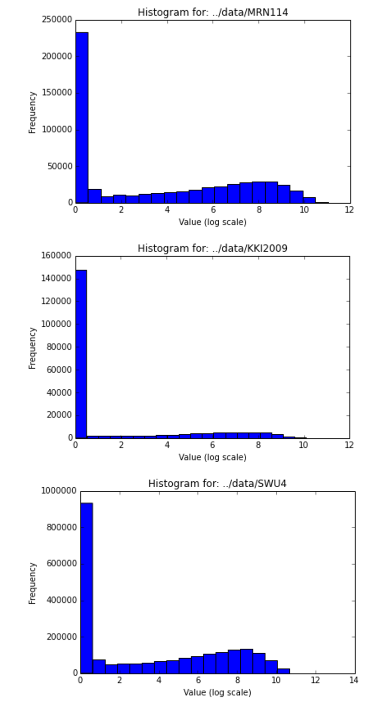

## Progress Report - March 20th, 2016

### Overview
Mental illness plagues humanity. Causing huge financial social burden, mental illness is the leading cause of disability globally. As such, we have been analyzing the structure of brain graphs with the goal of understanding underlying patterns or features which allow us to classify subjects based on observed covariates.

### Scientific Questioning
Here we will discuss our analysis of this data, starting with exploratory and descriptive analysis, up to preliminary work on hypothesis testing and classification. The questions posed and their outcomes are described sequentially, with code and methods used to answer them described at the end of this report.

#### Descriptive Analysis
The natural first step when working with any data is to ask exploratory and descriptive questions about it. We have been working with the KKI2009, SWU4, and MRN114 datasets, so we began by seeking some basic understanding of this data. It was important to understand the structure of our data, so we began by asking questions such as dataset size, number of nodes, and number of invalid (i.e. Inf/Na/NaN) data points were present in our data. Tabulated below are the results of these questions, where N  is the number of subjects, and |V| is the number of vertices. The final descriptive question asked was regarding the sparsity of our graphs: how many edges with weight greater than 0 exist out of the total possible number of edges. We found that across the entire dataset the edge density was 0.561.

| Query | MRN114 | KKI2009 | SWU4 |
|-------|--------|-------|------|
|N      | 114    | 42    | 454  |
| \|V\| | 70     | 70    | 70   |
|Invalid values | 0 | 0 | 0 |

#### Exploratory Analysis
Knowing now that our graphs are all equal in size (i.e. number of nodes), contain no obviously invalid data, but vary greatly in number of subjects, we seek to understand some more features specific to each dataset. The first exploratory question we asked was seeking to determine the average edge degree for each dataset. These results are tabulated below. We also compute the mean brain graph and visualize it, below.

| Query | MRN114 | KKI2009 | SWU4 |
|-------|--------|-------|------|
|Average Degree | 2862.2| 1396.7 | 2848.1 |

We notice here there is a large difference in the mean degree in these graphs, so in order to understand this further we plotted a histogram of the edge weights for each dataset. This can be seen below.

We notice from these graphs that most of the edges are very low weights, and likely due to some type of noise. Taking the log of our graphs may make these graphs more robust to outliers in our further analysis.

#### Inferential Analysis
We now seek to understand class conditional differences within our datasets. From here, we will be only looking at the KKI2009 dataset. The covariate we are seeking to separate graphs based upon is sex. Firstly we must pick a feature of our graphs to test this difference under. As we'd looked at this feature in our exploratory analysis, we chose to use edge density as our feature. Running a wilcoxon test on this population, in which 22 subjects were male and 20 subjects were female, we found the following mean probabilities of edge based on class.

| Class | Mean edge count |
|-------|-----------------|
| Female| 0.014041836735  |
| Male  | 0.013130376117  |

We found that the difference between these populations was statistically significant with an alpha value of 0.05, produciing a p value of 0.022768743719. Since we found a statistically significant difference between classes, we can naturally proceed to trying to classify subjects based on their edge density.

#### Predictive Analysis

### Methods

| Question Type | Code |
|---------------|------|
| Descriptive | [**``./code/descriptive_and_exploratory_answers.ipynb``**](./code/descriptive_and_exploratory_answers.ipynb) |
| Exploratory | [**``./code/descriptive_and_exploratory_answers.ipynb``**](./code/descriptive_and_exploratory_answers.ipynb) |
| Inferential | [**``./code/inferential_simulation.ipynb``**](./code/inferential_simulation.ipynb) |
| Predictive  | [**``./code/classification_simulation.ipynb``**](./code/classification_simulation.ipynb) |

**Prompt**: a report stating and organizing everything you've done so far to learn about and explore your data. this includes all the types of questions, ordered accordingly, plus a separate methods section.  for each analysis, make sure to explain the logical flow from one analysis to the next.  for example, if you ran BIC to estimate the number of clusters and found 4 clusters, this justifies looking at the mean and covariances of each of the clusters.
